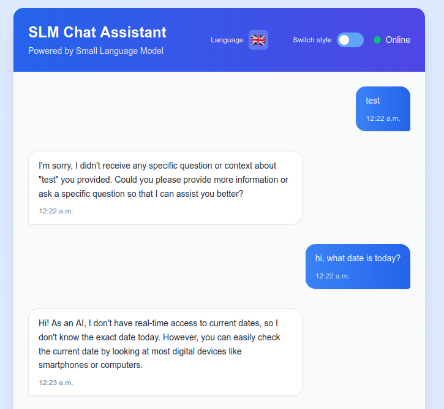
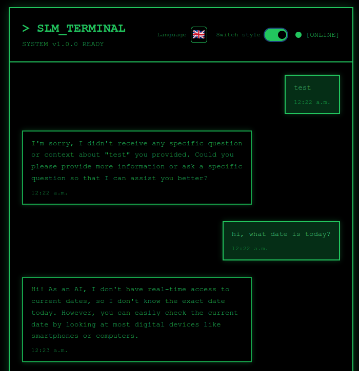

# Simple React + SLM Model

A proof-of-concept React application demonstrating clean architecture patterns with a bilingual AI chat interface.




## ✨ Key Features

- 🤖 **AI-Powered Chat** - Bilingual responses (English/French) from small language model
- 🎨 **Multiple Themes** - Modern and Terminal display modes
- 🏗️ **Clean Architecture** - Custom hooks, dependency injection, SOLID principles
- 🌍 **Internationalization** - Full English/French localization
- ⚡ **Performance** - Optimized rendering with request cancellation
- 🐳 **Docker-First** - Complete containerization with hot reload

## Tech Stack

- **Frontend**: React 18, TypeScript, Vite, Tailwind CSS
- **Backend**: Node.js, Express, TypeScript with OOP + DI patterns
- **AI Model**: Ollama with Qwen2.5-3B (bilingual support)
- **Infrastructure**: Docker Compose, Nginx

## 🚀 Quick Start

### Prerequisites

- Docker & Docker Compose
- 4GB+ RAM and 3GB+ disk space

### Get Running

```bash
# Clone and start
git clone https://github.com/sergueidmitriev/simple-react-slm-model.git
cd simple-react-slm-model
make dev

# Setup AI model (one-time, ~1.8GB download)
make model-setup

# Open browser
open http://localhost:3002
```

**Services:**

- Frontend: http://localhost:3002
- Backend API: http://localhost:3001
- Ollama API: http://localhost:11434

## Common Commands

```bash
make dev           # Start development
make down          # Stop all services
make logs          # View logs
make model-test    # Test AI model
make clean         # Clean Docker resources
```

## 🐛 Troubleshooting

**Model not responding?**

```bash
make model-list      # Check model status
make model-setup     # Re-download if needed
```

**Port conflicts?**

```bash
# Edit ports in docker-compose.dev.yml if needed
make down && make dev
```

## 🏗️ Architecture

**Frontend:**

- Custom hooks separate business logic from presentation
- Request cancellation with AbortController
- Type-safe discriminated unions
- Strategic performance optimizations

**Backend:**

- Interface-based design for loose coupling
- Dependency injection container
- SOLID principles
- Swappable model providers

## 📚 Documentation

- [Development Guide](./docs/DEVELOPMENT.md) - Setup and architecture
- [Model Setup](./docs/MODEL_SETUP.md) - Ollama configuration
- [Integration Guide](./docs/INTEGRATION.md) - System integration
- [Theme Architecture](./docs/THEME_ARCHITECTURE.md) - Theme system

## 📄 License

MIT License - see [LICENSE](./LICENSE) file for details.
